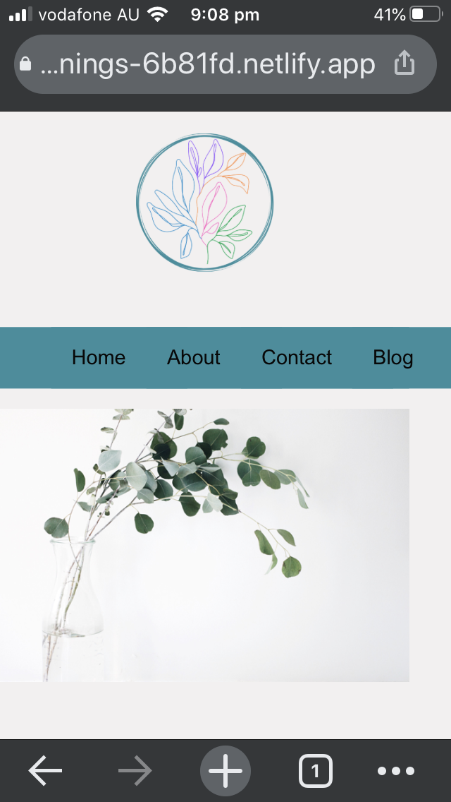
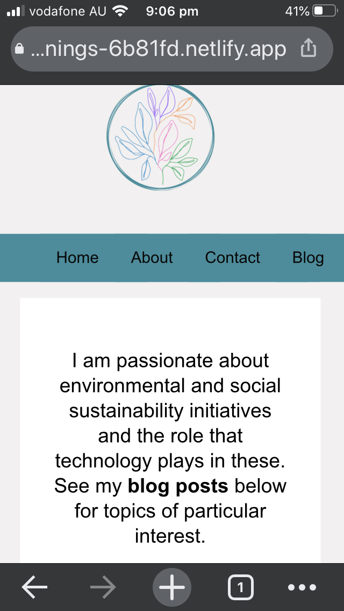
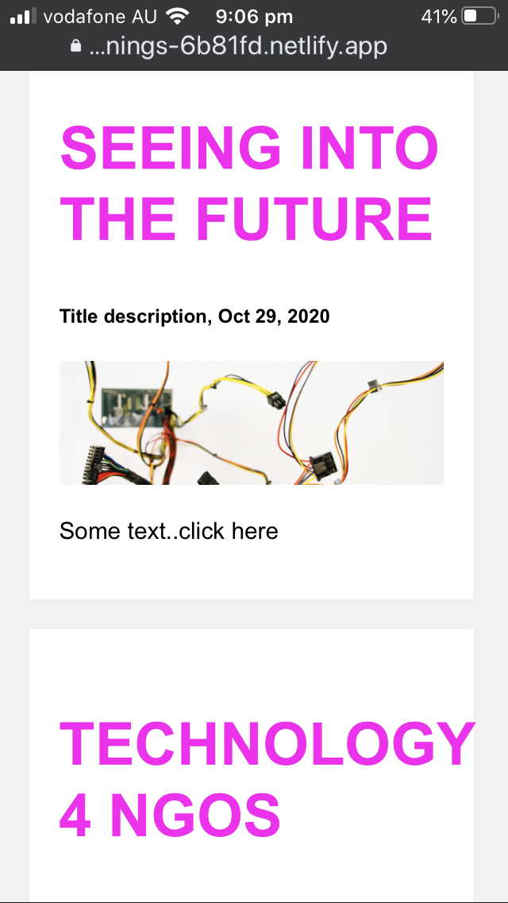
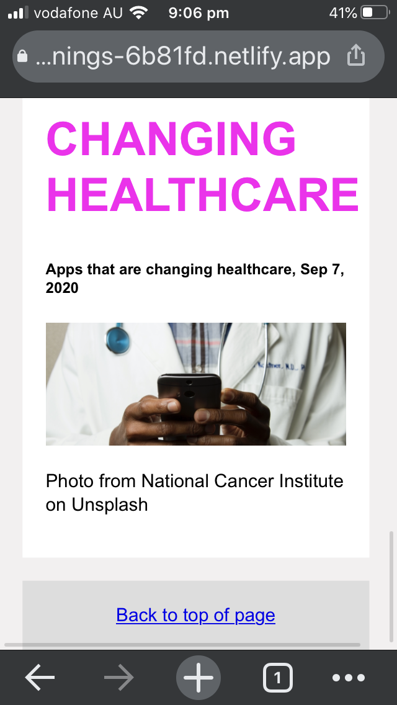
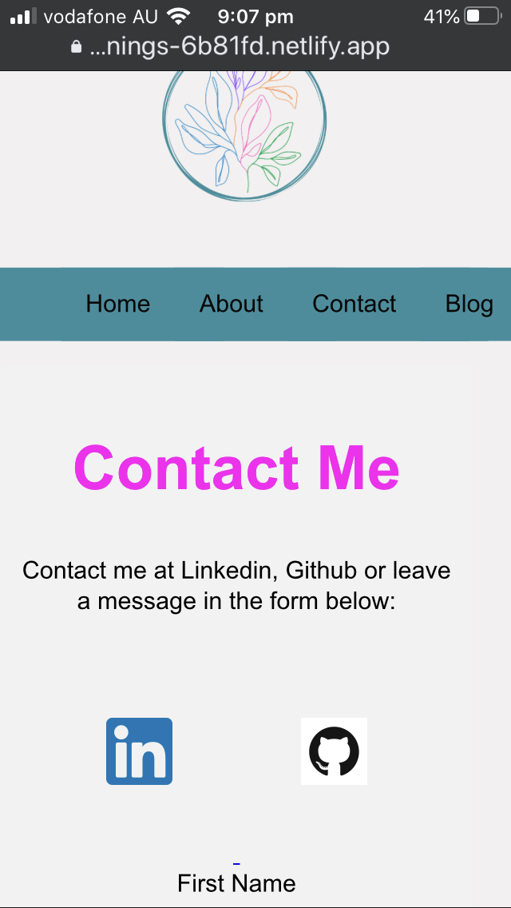
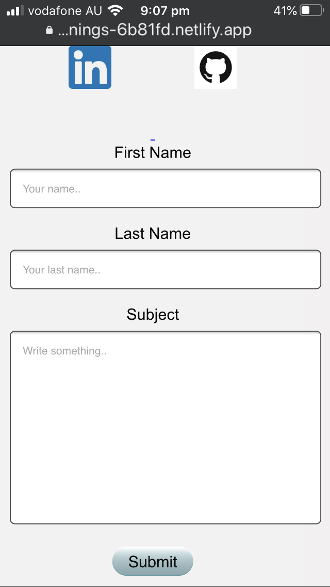
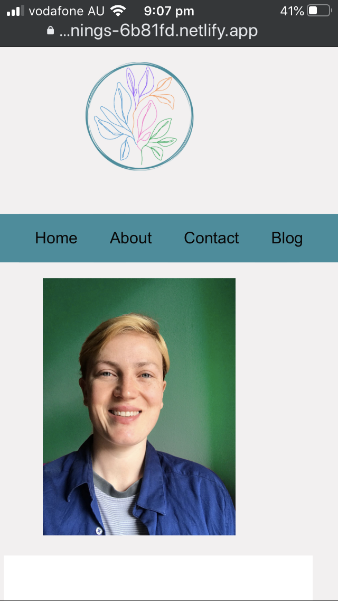
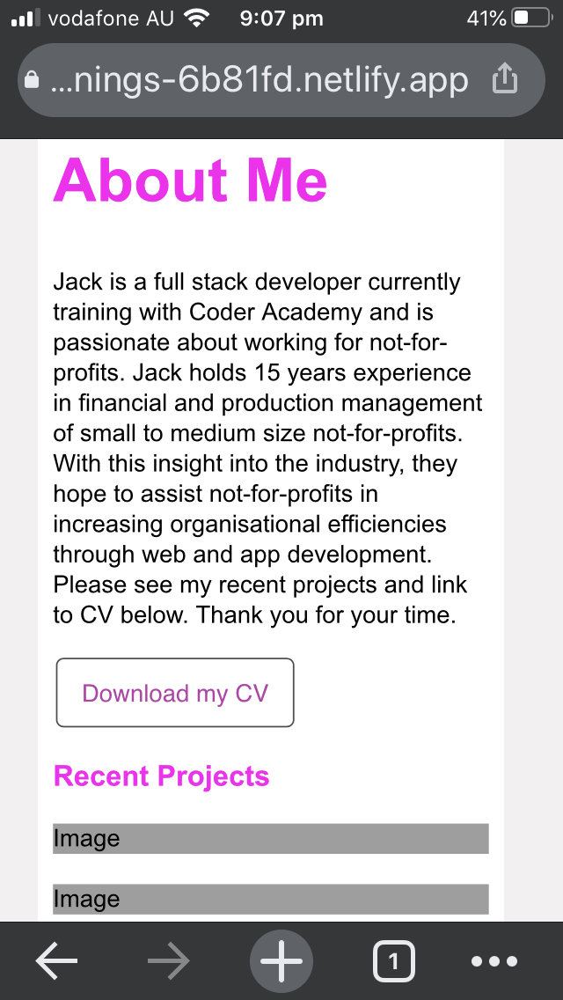
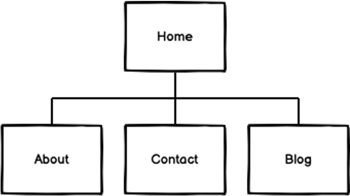

# Jack Martin's Portfolio T1A2 Assignment 
## README document 
__________

#### Link (URL) to published portfolio website 
###### https://brave-jennings-6b81fd.netlify.app/index.html

#### Link to my GitHub repo
https://github.com/jmartinmcg/Portfolio
__________

### Purpose
This website is constructed as a portfolio website for myself as a web developer and IT professional. The purpose of this website is to showcase my skills, personality and passions to prospective employers and other interested parties. 
___________

### Functionality / features 

1. Pages are navigated through a Navbar which sits underneath a logo on the top of each page. Note: this does not include subpages - like the click-through pages for blog posts - these have not been created yet for this project. However, they would not appear on the navbar if they were created. 
2. A logo sits on top of Navbar. The logo was also used as favicon. 

The rest of the features are listed below split by page. 

__________________

### Home Page

Nav bar, logo, background image and name. Scroll down has a description and image reference. 

#### Web View

#### Mobile View

______________

### Blog Page 

3. 'Blog' page has placeholders for blog posts and a link in the footer to redirect the viewer to the top of page. 

See screens for mobile view & responsive view

#### Web View

#### Mobile View

__________

#### Contact Page

4. 'Contact' page has a form to leave a message.
5. 'Contact' page has icon links to my Github and LinkedIn accounts.

#### Web View

#### Mobile View

___________

#### About Page

6. 'About' page has a downloadable CV and placeholders for recent projects. 
7. The website is responsive. The elements on the page stretch to the various sizes, so the view remains similar across screens of various sizes. However, the layout on the 'About' page changes layout depending on if it's in mobile view or not. In mobile view there is 1 column that scrolls down. On larger screens this changes to a 2 column view. These style changes are commented in the style.css page 

#### Web View

#### Mobile View

_____________

#### Sitemap

The website uses a 4 page layout. All pages can be navigated through a nav bar at the top of the website, underneath the logo. If I were to continue the website the sitemap would change to include; subpages for links to blog posts on the 'Blog' page, project posts on the 'About' page, message form links on the 'contact' page. 

___________

#### Target Audience 
* Prospective employers looking for a web developer
* Tech professionals for networking
* Tech enthusiastists for networking or interest 

______________

#### Tech stack 

1. HTML 
2. CSS
3. Markdown
4. Git 
5. Github
6. Terminal 
7. Balsamiq
8. VS Code 
9. Netlify
10. Draw io
11. Canva

-----------

#### Accessibility

Accessibility considerations were made in font contrast levels, use of semantic HTML and descriptions and tags in HTML. 

